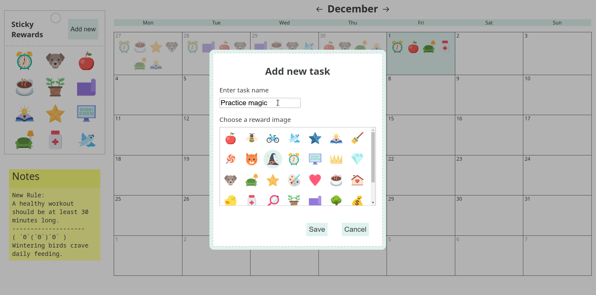
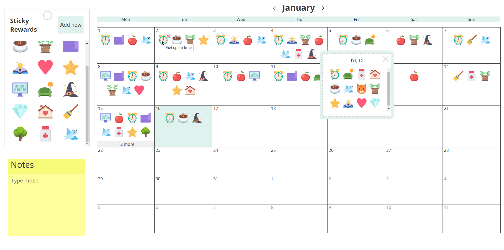

## Description

This is a monthly calendar application for visual tracking of frequently recurring positive tasks or events.

### Built with

- Vue.js 3
- TanStack Query v5
- TypeScript
- Vite

### Features

#### Tasks

- Create a task using the Add New button in the Stickers Pack area.
- Delete a task by clicking the cross button that appears when hovering over the task image.

#### Rewards

- Drag and drop a reward to add it on the specific date.
- Delete a reward by clicking the cross button that appears when hovering over the reward image in the date cell.

#### Memo pad

- Simply click outside the note area to save note text.

### Screenshots

<kbd>
  
</kbd>
 
 
<kbd>
  
</kbd>

### Notes

> A backend is not implemented yet.
